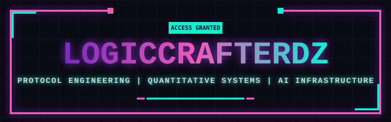
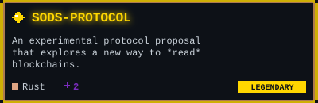
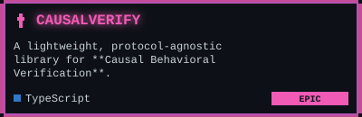
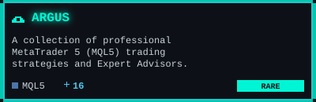
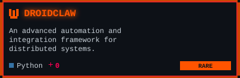
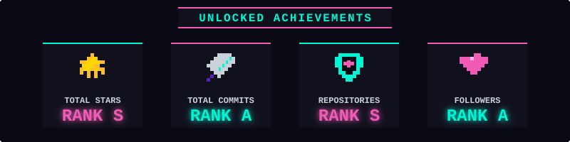
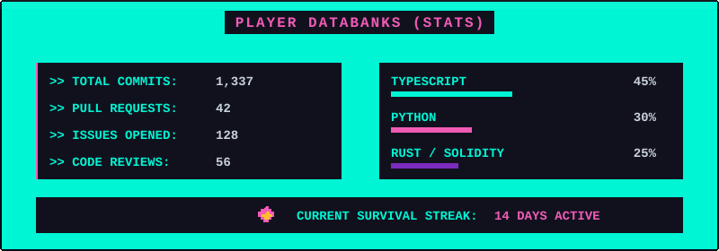

  

  
  
  
  

  

  

  

  
  

  
  

  

  

<picture>
  <source media="(prefers-color-scheme: dark)" srcset="https://raw.githubusercontent.com/logiccrafterdz/logiccrafterdz/output/github-snake-dark.svg">
  <source media="(prefers-color-scheme: light)" srcset="https://raw.githubusercontent.com/logiccrafterdz/logiccrafterdz/output/github-snake.svg">
  
</picture>

  

  

